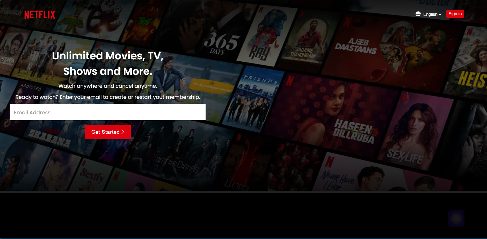
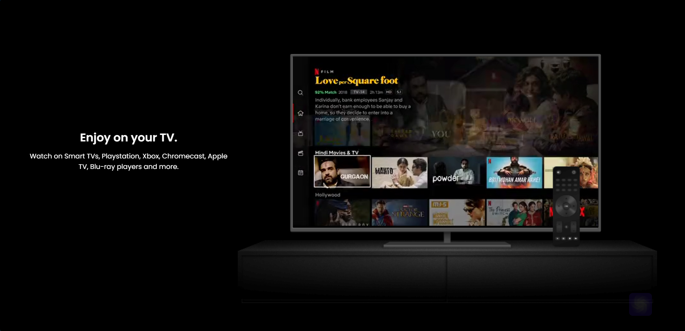
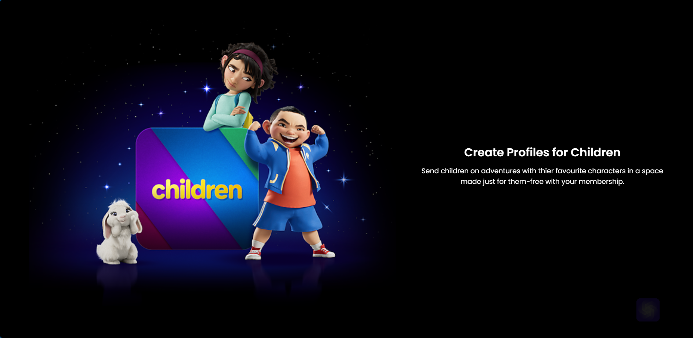

# Netflix Clone Project

Welcome to the **Netflix Clone** project! This is a fully responsive web application that replicates the core features of the popular streaming service, Netflix. Built using **HTML**, **CSS**, and **JavaScript**, this project showcases my front-end development skills and ability to create visually appealing and functional user interfaces.

## Features

- **Responsive Design**: The application is designed to work seamlessly across various devices, including desktops, tablets, and mobile phones.
- **Interactive UI**: The user interface is interactive and user-friendly, with hover effects and dynamic content loading.
- **Custom Profiles**: Users can create and manage profiles, similar to Netflix, allowing for a personalized experience.
- **Content Carousel**: A dynamic carousel showcases featured content, with smooth transitions and clickable elements.
- **Search Functionality**: Integrated search functionality allows users to find their favorite movies and TV shows quickly.

## Technologies Used

- **HTML**: For structuring the content of the web pages.
- **CSS**: For styling and creating a visually appealing layout.
- **JavaScript**: For adding interactivity and dynamic content.

## Screenshots

Here are some screenshots of the project:





## Installation

To run this project locally, follow these steps:

1. **Clone the repository**:
   ```bash
   git clone https://github.com/vikaspinninti/netflix_clone.git
   ```

2. **Navigate to the project directory**:
   ```bash
   cd netflix_clone
   ```

3. **Open the project**:
   - Open the `index.html` file in your preferred web browser.

## Usage

- **Navigation**: Use the navigation bar to explore different sections of the application.
- **Profile Management**: Create and switch between profiles to customize your viewing experience.
- **Search**: Use the search bar to find specific movies or TV shows.

## Contributing

Contributions are welcome! If you have any suggestions or improvements, please feel free to fork the repository and submit a pull request.

## License

This project is licensed under the MIT License - see the [LICENSE](LICENSE) file for details.

## Contact

If you have any questions or would like to connect, feel free to reach out to me via [email](mailto:vikaspinninti76@gmail.com) or connect with me on [LinkedIn](https://www.linkedin.com/in/vikaspinninti).

---

Thank you for checking out my Netflix Clone project! I hope it demonstrates my skills and passion for front-end development. Looking forward to any feedback or opportunities to collaborate!
